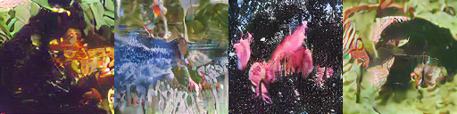

# HW5-README

# Objective

This project aims to implement a Latent Diffusion Model (LDM) enhanced U-Net framework, which performs denoising in a compressed latent space using a pre-trained Variational Autoencoder (VAE) to reduce computational overhead while preserving fidelity. To further enhance the generation quality, we incorporate Classifier-Free Guidance (CFG)  for class-conditional generation and integrate Transformer blocks into the U-Net bottleneck to improve the model’s capacity for capturing long-range dependencies. Our objective is to develop a scalable, computationally efficient, and high-fidelity image generation pipeline.

# Wandb Log

https://wandb.ai/idl-/IDL-hw5-Ivy

https://wandb.ai/islakong-carnegie-mellon-university/dl-hw5

https://wandb.ai/idl-/dl-hw5

# Methodology

## U-Net Architecture

The U-Net is the backbone of our diffusion model, designed to predict noise at each timestep. It uses a symmetric encoder-decoder structure with skip connections, where the encoder reduces spatial resolution and increases channels, and the decoder reverses this process. Middle layers handle low-resolution features for better pattern recognition. Each level includes ResBlocks with normalization and residuals to support training. A sinusoidal embedding encodes the timestep, allowing the model to adjust to noise levels. Channel depth increases as resolution decreases to improve multi-scale feature learning.

## Schedulers

The DDPM scheduler defines the noise variance schedule during both forward and reverse diffusion. We also experimented with DDIM. The DDIM scheduler accelerates sampling by redefining the reverse process without requiring a strict Markov chain. This allows the reverse process to skip multiple steps, significantly reducing the inference time. 

## Variational Autoencoder (VAE)

Variational Autoencoder (VAE) compresses input images into a lower-dimensional latent space through a probabilistic mapping to improve training efficiency.

Operating in the latent space provides the following computational benefits:

- A 16× reduction in space significantly decreases memory usage and computational cost.
- Compression focuses modeling capacity on semantically meaningful variations rather than redundant pixel-level details.
- Smoother latent distributions lead to more stable training dynamics and faster convergence.

## Classifier-Free Guidance (CFG)

Classifier-Free Guidance (CFG) improves alignment between generated samples and conditioning inputs (such as class labels or text prompts) without requiring a separate classifier.

## Transformer Block

The transformer Block is incorporated in the U-Net bottleneck module in place of the traditional ResNet block to further enhance the model's capacity. This modification allows the model to better capture long-range dependencies across spatial features at the lowest resolution, where computation is more efficient.

The transformer block first flattens the feature map into a sequence of tokens and adds learnable positional embeddings. Each block then applies Adaptive Layer Normalization (AdaLN) conditioned on the timestep and optional class embedding, followed by Multi-Head Self-Attention and a two-layer MLP. Residual connections are used around both the attention and MLP sub-layers.

# Instructions to run the code

## Train
Run the following code to start training
```bash
python train.py --config <path/to/your/config.yaml>
```
- DDPM Model: set "latent_ddpm: False" "use_cfg: False" "use_transformer_bottleneck: False" in config
- DDPM + VAE Model: set "latent_ddpm: True" "use_cfg: False" "use_transformer_bottleneck: False" in config
- DDPM + VAE + CFG Model: set "latent_ddpm: True" "use_cfg: True" "use_transformer_bottleneck: False" in config
- DDPM + VAE + CFG + Transformer Model: set "latent_ddpm: True" "use_cfg: True" "use_transformer_bottleneck: True" in config

## Inference
Run the following code to start inferencing
```bash
python inference.py --config <path/to/your/config.yaml>
```
- DDPM Scheduler: set "use_ddim: False" in config
- DDIM Scheduler: set "use_ddim: True" in config

# Config
The following config is for DDPM + VAE + CFG + Transformer model, you could choose to enable or disable some feature following the "instructions to run the code".
```yaml
seed: 42

DEBUG: False
output_dir: /workspace/experiments

# dataset
dataset: imagenet100
data_dir: /workspace/data
val_data_dir: /workspace/data/imagenet100_128x128/validation
subset: 1.0
image_size: 128
num_classes: 100

# training
batch_size: 64
num_workers: 16
num_epochs: 300
# mixed_precision: bf16

# optimizer
warmup_epochs: 10
max_epochs: 300
learning_rate: 5e-5
weight_decay: 1e-4

# wandb
wandb_username: <Your Wandb Username>
wandb_key: <Your Wandb Key>
project_name: <Your Wandb Project Name>
run_name: <Your Wandb Run Name>

# resume wandb
resume: False
wandb_resume_id: <Your Resume ID>
resume_checkpoint_path: <Path to Your Checkpoint>

# # unet (Uncomment this if using Unet only model)
# unet_in_size: 64
# unet_in_ch: 3
# unet_ch: 128
# unet_ch_mult: [1, 2, 2, 4]
# unet_attn: [2, 3]
# unet_num_res_blocks: 2
# unet_dropout: 0.0
# use_adagn_resblock: False
# use_transformer_bottleneck: False
# transformer_depth: 1
# transformer_num_heads: 8

# vae unet (Uncomment this if using latent VAE)
unet_in_size: 32
unet_in_ch: 3
unet_ch: 192
unet_ch_mult: [1, 2, 2, 4]
unet_attn: [2, 3]
unet_num_res_blocks: 3
unet_dropout: 0.1
use_adagn_resblock: False
use_transformer_bottleneck: True
transformer_depth: 4
transformer_num_heads: 8

vae_config:
  double_z: True
  z_channels: 3
  embed_dim: 3
  resolution: 256
  in_channels: 3
  out_ch: 3
  ch: 128
  ch_mult: [1, 2, 4]
  num_res_blocks: 2

# ddpm
num_train_timesteps: 1000
num_inference_steps: 1000
beta_start: 0.0002
beta_end: 0.02
beta_schedule: cosine
variance_type: fixed_small
predictor_type: epsilon

# latent
latent_ddpm: True
vae_ckpt: "/workspace/pretrained/Model.ckpt"
freeze_vae_epoch: 10 # since this epoch, index starting from 1
kl_beta: 0.0005
lpips_lambda: 1.0
vae_lambda: 0.05

# cfg
use_cfg: True
cfg_guidance_scale: 3.0
cond_drop_rate: 0.1

# ddim
use_ddim: False

# checkpoint
keep_last_n: 1 # including the last one
keep_last_model: False
keep_best_model: False

# evaluation during training
eval_during_train: True
eval_every_n_epoch: 10 # it takes 10 min to generate 500 images for evaluation each time
eval_samples: 500 # 500
eval_classes: 50 # 50

# inference
ckpt: <Path to Your Checkpoint>
inference_samples: 5000

```

# Results

We evaluated the baseline and enhanced models using the metrics summarizes the FID and IS scores for each model.

The baseline model using DDPM scheduler achieved an FID score of 85.35, IS of 5.41 and LPIPS of 07312. While the model generated images that resembled real samples (see Fig.1), they struggled to generalize across diverse object categories. Outputs often lacked sharpness and fine-grained detail.


The baseline model using DDIM scheduler obtained an FID score of 97.42, IS of 5.22 and LPIPS of 0.8346, performing slightly worse in image quality compared to DDPM. Although DDIM reduced the number of inference steps to 500 compared to 1000 in DDPM, it did not significantly accelerate training or improve image quality. Therefore, we selected DDPM as the backbone scheduler for the enhanced models.

The VAE and CFG enhanced model significantly reduced training and inference time, but at the cost of image quality, showing a higher FID of 123.44, lower IS of 4.37 and higher LPIPS of 0.7202. Visual inspection revealed that the generated images captured local details but lacked sufficient structural clarity in Fig.2.


In contrast, integrating Transformer blocks into the bottleneck improved generation fidelity. This model achieved a better balance, with an FID of 121.07 and IS of 4.67, and produced sharper boundaries and finer details in Fig.3.

Overall, our experiments demonstrate that while VAE and CFG integration improves computational efficiency, adding Transformer bottlenecks effectively restores and enhances image quality, achieving a better trade-off between speed and fidelity.



| Model                         | FID    | IS            | LPIPS  |
|------------------------------|--------|---------------|--------|
| DDPM                         | 85.35  | 5.41 ± 0.25   | 0.7312 |
| DDIM                         | 97.42  | 5.22 ± 0.23   | 0.8346 |
| DDPM + VAE + CFG             | 123.44 | 4.37 ± 0.19   | 0.7202 |
| DDPM + VAE + CFG + Transformer | 121.07 | 4.67 ± 0.20   | 0.7113 |

Table 1. Inference FID and IS scores for different models